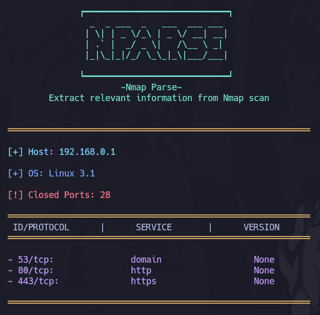

# NMAP PARSER
#### This tool will parse relevant information from nmap scan with an XML output 

## How to use it :

#### Make a Nmap scan and use the -oX parameter to export the output into an XML file, then just pass the XML file as a parameter to the Nparser.

~~~~ python

              ┍━━━━━━━━━━━━━━━━━━━━━━━━━━━━┑
                _  _ ___  _   ___  ___ ___ 
               | \| | _ \/_\ | _ \/ __| __|
               | .` |  _/ _ \|   /\__ \ _| 
               |_|\_|_|/_/ \_\_|_\|___/___|

              ┕━━━━━━━━━━━━━━━━━━━━━━━━━━━━┙
                      -Nmap Parse-
        Extract relevant information from Nmap scan 

usage: nmap_parser.py [-h] file

Parse Nmap XML file and extract relevant information.

positional arguments:
  file        Path to the Nmap XML file

options:
  -h, --help  show this help message and exit

Example: python nmap_parser.py scan.xml
~~~~

## Output Screenshots

## Libraries used:
- **argparse** ---> https://docs.python.org/es/3/library/argparse.html
- **xml.etree.ElementTree** ---> https://docs.python.org/3/library/xml.etree.elementtree.html *
- **termcolor** ---> https://pypi.org/project/termcolor/

\* ( read about vulnerabilities in the site )
